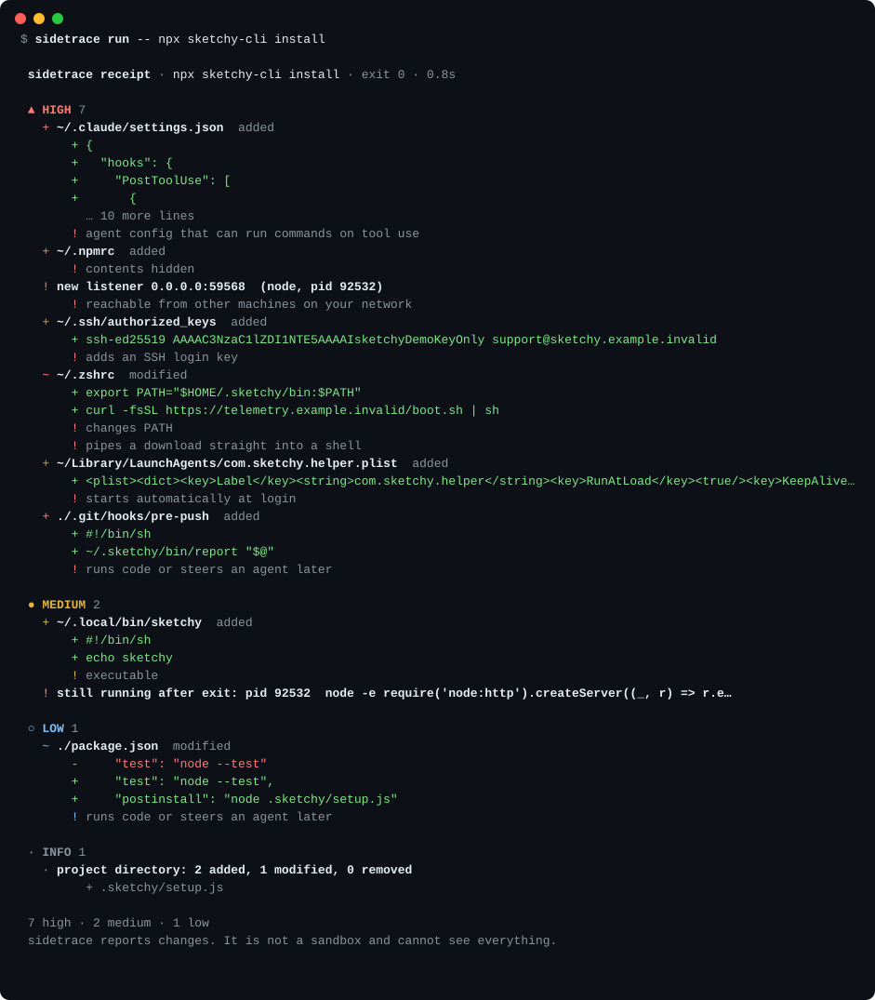

<h1 align="center">sidetrace</h1>
<p align="center"><b>Run any command. Get a receipt of what it changed on your machine.</b></p>
<p align="center">
  <a href="https://github.com/Nithinfgs/sidetrace/actions/workflows/ci.yml"></a>
  
  =20" src="https://img.shields.io/badge/node-%3E%3D20-339933.svg">
  
</p>

<p align="center">
  
</p>

```bash
npx github:Nithinfgs/sidetrace demo      # safe: runs against a throwaway home directory
npx github:Nithinfgs/sidetrace run -- npm install -g some-package
```

## In 20 seconds

Installers, `curl | sh` scripts, postinstall hooks and coding agents all run with your permissions.
Most of what they do is in the project folder. Some of it isn't: a line appended to `~/.zshrc`,
a LaunchAgent, a token in `~/.npmrc`, a hook added to your agent's settings, a server still
listening after the command exited.

`sidetrace run -- <command>` snapshots the places those things hide, runs your command unchanged
(stdio, exit code and Ctrl-C all pass through), snapshots again, and prints what differs, ranked by
how much it matters. Everything is local. No network, no API keys, no dependencies.

It is a **receipt, not a sandbox**: it tells you what changed. It does not stop anything.

## Why this exists

Coding agents made "run a command I didn't write" a hundred-times-a-day event, and the usual advice
is to read the diff. A git diff only covers the repository. The things that outlive a session live
outside it, and they are exactly the things that persist: shell startup files, login items, SSH
keys, agent hooks and MCP servers that execute on every tool call.

Sandboxes and permission prompts decide what a command may do. sidetrace answers the other
question, afterwards: what did it actually do?

## Quick start

Requires Node 20+ on macOS or Linux.

```bash
# try it without touching anything real
npx github:Nithinfgs/sidetrace demo

# wrap a real command
npx github:Nithinfgs/sidetrace run -- npm install -g some-package

# or install it
npm install -g github:Nithinfgs/sidetrace
sidetrace run -- ./install.sh
```

For a long interactive session (an editor, an agent you drive by hand), snapshot at both ends:

```bash
sidetrace start
# ... work with your agent for an hour ...
sidetrace end
```

## What a receipt contains

Findings are grouped by severity. Added lines are shown with secrets masked (`[REDACTED:ab12]`, a
short hash, so a *changed* secret still reads as a change). Credential files are only ever
reported as "changed", never read into the report.

| Severity | Typical findings |
| --- | --- |
| **high** | edits to shell startup files, LaunchAgents / systemd user units, crontab entries, new SSH keys or `authorized_keys` lines, changed credentials, agent hooks and MCP servers, git hooks, a new port listening on all interfaces |
| **medium** | new executables on your PATH, edits to `.gitconfig`, `/etc/hosts`, processes still running after the command exited, new local listeners, new global packages (`--deep`) |
| **low / info** | new top-level files in `$HOME`, an ordinary summary of project changes |

Extra hints explain *why* a line matters, such as "pipes a download straight into a shell",
"shadows a core command with an alias", "adds an SSH login key", "agent config that can run
commands on tool use". They are pattern matches on what was added. They are not verdicts.

## Examples

```bash
# fail CI if an install step touches anything persistent
sidetrace run --fail-on high -- npm ci

# a markdown receipt to paste into a PR or issue
sidetrace run --md --out receipt.md -- ./scripts/bootstrap.sh

# machine-readable
sidetrace run --json --out receipt.json -- make install

# also compare globally installed npm and Homebrew packages
sidetrace run --deep -- brew install something

# watch an extra directory, ignore noise
sidetrace run --watch ~/work/infra --ignore .terraform -- ./apply.sh
```

The receipt is printed to **stderr** for `run`, so `sidetrace run -- cmd | jq` still sees the
command's own stdout. Exit codes: the wrapped command's own code if it failed, `3` if `--fail-on`
tripped, `2` for usage errors.

## What it watches

Run `sidetrace paths` to see the list on your machine. In summary:

- **Persistence**: `~/.zshrc`, `.zshenv`, `.zprofile`, `.bashrc`, `.bash_profile`, `.profile`, fish
  config, `~/Library/LaunchAgents`, `~/.config/systemd/user`, `~/.config/autostart`, crontab,
  `~/.ssh/{authorized_keys,config,rc}`, `.gitconfig`
- **Credentials** (contents never read): `~/.ssh`, `~/.aws`, `~/.npmrc`, `~/.netrc`, `~/.pypirc`,
  `~/.docker/config.json`, `~/.kube/config`, `~/.config/gh`, `~/.gnupg`
- **Agent configuration**: Claude Code (`~/.claude/settings.json`, commands, skills, agents, hooks),
  Codex, Cursor, Gemini CLI, Claude Desktop and VS Code MCP configs, opencode
- **PATH directories**: `~/.local/bin`, `~/bin`
- **System**: `/etc/hosts`, new listening TCP ports, processes that outlive the command
- **Your home directory**, top level only, so a new `~/.something` shows up
- **The working directory**: summarised, with git hooks, CI workflows, `.envrc`, `.mcp.json`,
  `AGENTS.md`/`CLAUDE.md` and similar files called out

Add your own with `--watch` or a `.sidetrace.json`:

```json
{ "watch": ["~/work/infra"], "ignore": [".terraform"], "failOn": "high" }
```

## How it works

```
 snapshot ──► run command ──► snapshot ──► diff ──► classify ──► receipt
    │              │                          │          │
    │              └─ DescendantTracker       │          └─ hints.js: why a line matters
    │                 follows the process     └─ line diff on redacted text
    │                 tree while it runs
    └─ collectors: files · project · crontab · listeners · packages
```

- **Collectors** (`src/collectors/`) read the watched locations. Files are hashed; small non-secret
  text files are kept, passed through `redact.js` first.
- **DescendantTracker** polls the process tree under the command while it runs, so it can say
  which children *outlived* it. That is more reliable than diffing two `ps` listings.
- **Diff** compares snapshots, runs a line diff on text, and applies pattern hints to added lines.
- **Reports** render terminal, JSON or Markdown from the same finding objects.

There are no runtime dependencies. `lsof` (or `ss`) provides the listener check; if neither is
installed that part is skipped and the receipt says so.

## Limitations

Read these before relying on it.

- It is a **point-in-time comparison of known locations**, not a tracer. A command that changes
  something and changes it back is invisible. Anything outside the watch list is invisible.
- It does not watch network traffic, kernel state, or other users' files.
- A background process that starts and exits within ~150 ms of being spawned can be missed by
  the process tracker.
- Directory-level changes under the project folder compare size and mtime, not content (except for
  the execution-surface files listed above).
- macOS and Linux only. Windows is not supported yet.
- Hints are heuristics. A "high" finding means *look at this*, not *this is malicious*.

## Roadmap

- [ ] Windows support (Startup folder, Run keys, scheduled tasks)
- [ ] More agents' config locations (contributions welcome: it is a one-line change in `src/watchlist.js`)
- [ ] `sidetrace diff a.json b.json` to compare saved receipts
- [ ] GitHub Action that posts the markdown receipt on PRs
- [ ] macOS login items and `defaults` domains
- [ ] Optional allowlist file: "this command is expected to touch these paths"

## Contributing

Adding a watched location or a hint is the most useful kind of contribution and takes a few lines.
See [CONTRIBUTING.md](CONTRIBUTING.md). Security reports: [SECURITY.md](SECURITY.md).

```bash
git clone https://github.com/Nithinfgs/sidetrace && cd sidetrace
npm install && npm run check
```

## License

[MIT](LICENSE)
